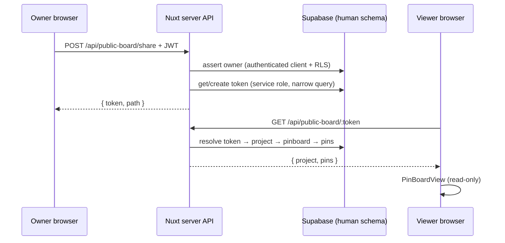

# Public pinboard sharing

How the **Share board** feature works in the Explorer pinboard, from the owner clicking share to an anonymous viewer opening a pin.

## User flow

1. A signed-in project owner opens their private pinboard (`/explorer/board`).
2. They click **Share board** in the deliverable header.
3. The app calls `POST /api/public-board/share` with the current `projectId` and the user’s session bearer token.
4. The server verifies ownership, creates or reuses an enabled share token, and returns a path such as `/explorer/board/public/<token>`.
5. The full URL is copied to the clipboard (origin + path).
6. Anyone with the link opens `/explorer/board/public/<token>`. No login is required.
7. The public page loads pins via `GET /api/public-board/<token>` and renders them read-only in `PinBoardView`.

There is no separate “make public” toggle: sharing always means “ensure a token exists and copy the link.”

## What is shared

| Included | Excluded |
|----------|----------|
| Project display name | Project UUID in the URL |
| Pins on the project’s pinboard (ordered) | Saved searches |
| Opening articles from pins (via public knowledge APIs) | Pin edit / delete / create |
| Read-only board UI | Artifact generation, podcast export, etc. |

The public URL uses an **opaque token**, not the project UUID, so links can be rotated later without changing the project id.

## Architecture (short)

### Key files

| Area | Location |
|------|----------|
| Share button | `apps/web/app/components/explorer/deliverable1/DeliverableHeader.vue` |
| Public page | `apps/web/app/pages/explorer/board/public/[id].vue` (`[id]` = token) |
| Public loader | `apps/web/app/composables/usePublicBoard.ts` |
| Share API | `apps/web/server/api/public-board/share.post.ts` |
| Read API | `apps/web/server/api/public-board/[token].get.ts` |
| Server logic | `apps/web/server/utils/publicBoardSharing.ts` |
| DB table | `human.project_share_links` (`packages/supabase-setup/sql/06_human_project_share_links.sql`) |
| Service-role grants | `packages/supabase-setup/sql/06_human_public_board_service_grants.sql` |

### Database

- Table `human.project_share_links`: one enabled token per project (reused on repeat share clicks), `enabled` + `revoked_at` for future revocation.
- Browser roles (`anon`, `authenticated`) have **no direct** access to this table; only `service_role` does.
- Pins and projects remain owner-only for direct Supabase client access; public viewers never call `usePinsSupabase` on the private board path.

## Environment

The web app needs:

| Variable | Where | Purpose |
|----------|--------|---------|
| `SUPABASE_URL` | `apps/web/.env` | API URL |
| `SUPABASE_PUBLISHABLE_KEY` | `apps/web/.env` | Owner auth + public knowledge reads |
| `SUPABASE_SERVICE_ROLE_KEY` | repo root `.env` or `apps/web/.env` | Share-link + public board read on server only |

Local dev: Nuxt merges the repo root `.env` into `apps/web` so `SUPABASE_SERVICE_ROLE_KEY` in the root file is picked up (see `apps/web/nuxt.config.ts`).

## Related docs

- [Server Supabase keys and security](./server-supabase-security.md) — which key to use where, grants, and pitfalls.
- OpenSpec design: `openspec/changes/restore-public-pinboard/design.md`
