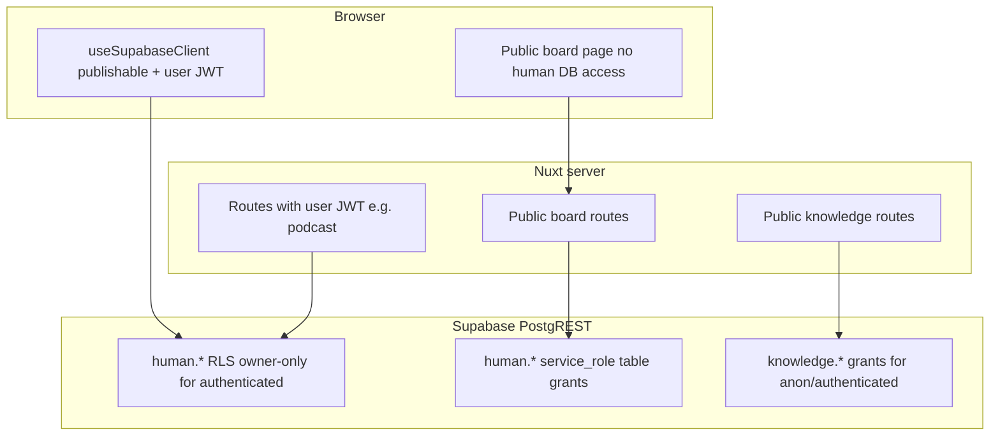

# Server Supabase keys and security

How the Nuxt server talks to Supabase, which credentials to use, and how to avoid common permission and leakage mistakes. Applies to public pinboard sharing, Explorer search, podcasts, and other server routes.

## Two keys, two purposes

| Key | Config | Exposed to browser? | Typical use |
|-----|--------|---------------------|-------------|
| **Publishable** (anon) | `runtimeConfig.public.supabasePublishableKey` | Yes (by design) | Client `useSupabaseClient`, server routes that mirror anonymous/public access |
| **Service role** | `runtimeConfig.supabaseServiceRoleKey` | **Never** | Server-only routes that must bypass owner RLS on `human.*` with explicit SQL grants |

Rules from project conventions:

- Never put `SUPABASE_SERVICE_ROLE_KEY` in `runtimeConfig.public` or client bundles.
- Never log or return service role keys in API responses.

## Architecture overview

### Three server client patterns (use the right one)

| Helper | Key | When to use |
|--------|-----|-------------|
| `createPublicKnowledgeSupabaseClient()` — `apps/web/server/utils/knowledgeSupabase.ts` | Publishable only | Search, facets, `document-by-uid`, articles, corpus metadata, recipe, pinboard export knowledge fetch |
| `createUserSupabaseClient(token)` — `apps/web/server/utils/podcastSupabase.ts` | Publishable + `Authorization: Bearer <user JWT>` | Owner-scoped `human.*` (projects, pins, artifacts) with RLS |
| `createServiceSupabaseClient()` — `apps/web/server/utils/publicBoardSharing.ts` | Service role only | Public pinboard: `project_share_links`, read project/pinboard/pins after token validation |

**Do not** use `serviceRoleKey || publishableKey` on knowledge routes. That pattern accidentally used the service role once the key was configured, but `service_role` is **not** granted `USAGE` on schema `knowledge`, which caused `permission denied for schema knowledge`.

## Public pinboard: threat model and mitigations

| Risk | Mitigation |
|------|------------|
| Project UUID in share URL | Opaque high-entropy token in `human.project_share_links` |
| Anyone querying all projects/pins via Supabase REST | No `anon`/`authenticated` grants on share links; pins/projects stay RLS owner-only for browsers |
| Service role reads entire database | Only `publicBoardSharing.ts` uses service role; fixed queries after token check; whitelisted JSON response |
| Guessable share tokens | `randomBytes(32)` base64url; DB uniqueness constraint |
| Public board enables editing | Public page: `enableSelection=false`, `includeSavedSearches=false`; no write APIs on public routes |
| Token in logs/analytics | Treat tokens like passwords in logs; avoid logging full public URLs in production info logs |

Share creation still requires a **signed-in owner** (`authenticatedSupabaseFromEvent` + `assertOwnProject`). Public read requires a **valid enabled token** only.

### Required SQL grants (human schema)

Service role bypasses RLS but still needs **table-level** privileges:

1. `06_human_project_share_links.sql` — full CRUD on `human.project_share_links` for `service_role`
2. `06_human_public_board_service_grants.sql` — `SELECT` on `human.projects`, `human.pinboards`, `human.pins` for `service_role`

Without (2), public board load fails with `permission denied for table projects` even with a valid service role key.

## Knowledge (corpus) access

- Schema `knowledge` is public-read for `anon` / `authenticated` (see `packages/db/sql/06_public_api.sql`).
- Server routes that call `public.hybrid_search`, `get_document_by_uid`, etc. should use **`createPublicKnowledgeSupabaseClient()`** so behavior matches anonymous Explorer users.
- Opening an article from a public pin uses `GET /api/document-by-uid` → publishable client → RPC `get_document_by_uid`.

## Environment checklist

| Check | Action |
|-------|--------|
| Service role only on server | Set `SUPABASE_SERVICE_ROLE_KEY` in deployment env for the web app; never prefix with `NUXT_PUBLIC_` |
| Publishable in web app | `SUPABASE_PUBLISHABLE_KEY` in `apps/web/.env` |
| Local monorepo layout | Service role may live in repo root `.env`; `nuxt.config.ts` merges it for `apps/web` |
| After grant/migration changes | Apply `packages/supabase-setup` SQL or Supabase MCP migration on each environment |
| New server route touching `human.*` | Decide: user JWT + RLS, or service role + narrow query + explicit `GRANT` — do not default to service role |

## Adding new server features safely

1. **List data already public to anon** (e.g. knowledge documents) → publishable client + existing public RPCs.
2. **Act as the logged-in user** on owned rows → publishable + user bearer token (`podcastSupabase` pattern).
3. **Bypass RLS for a controlled server workflow** (e.g. token-gated public read) → service role + new table grants + fixed handler code + whitelisted response; document in this file.

Avoid:

- Widening `anon` SELECT on `human.pins` / `human.projects` for convenience.
- Passing arbitrary filters or table names into service-role queries.
- Reusing `createServiceSupabaseClient()` outside `publicBoardSharing` without a security review.

## Code audit reference (current repo)

| Uses service role | Uses publishable (knowledge) | Uses publishable + user JWT |
|-------------------|------------------------------|-----------------------------|
| `publicBoardSharing.ts` | `knowledgeSupabase.ts` consumers | `podcastSupabase.ts` consumers |
| `public-board/share.post.ts` | `explorer-search`, `search`, `facets`, `document-by-uid`, … | Podcast / artifact routes |
| `public-board/[token].get.ts` | | |

`supabaseServiceRoleKey` appears only in `nuxt.config.ts` and `publicBoardSharing.ts`.

## Related docs

- [Public pinboard sharing](./public-pinboard-sharing.md) — feature flow and files
- `packages/supabase-setup/README.md` — bootstrap SQL order
- `.cursor/rules/stack-and-mcp.md` — agent rule: never expose service role on the client
